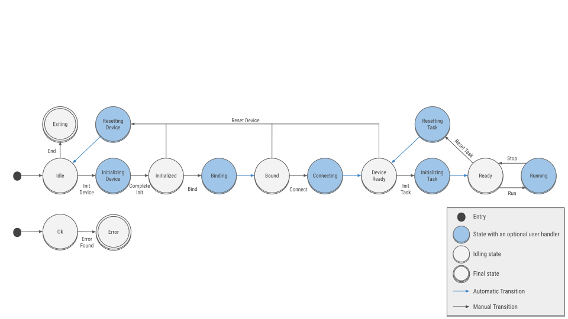

← [Back](../README.md)

# 1. Device

The components encapsulating the tasks are called **devices** and derive from the common base class `FairMQDevice`. FairMQ provides ready to use devices to organize the dataflow between the components (without touching the contents of a message), providing functionality like merging and splitting of the data stream (see subdirectory `devices`).

## 1.1 Topology

Devices are arranged into **topologies** where each device has a defined number of data inputs and outputs.

Example of a simple FairMQ topology:

Within a topology each device needs a unique id (given to it via required command line option `--id`).

Topology configuration is currently happening via setup scripts. This is very rudimentary and a much more flexible system is now in development. For now, example setup scripts can be found in directory `FairRoot/example/Tutorial3/` along with some additional documentation.

## 1.2 Communication Patterns

FairMQ devices communicate via the communication patterns offered by ZeroMQ (or nanomsg): PUSH-PULL, PUB-SUB, REQ-REP, PAIR, [more info here](http://api.zeromq.org/4-0:zmq-socket). Each transport may provide further patterns.

## 1.3 State Machine

Each FairMQ device has an internal state machine:

The state machine can be querried and controlled via `GetCurrentStateName()` and `ChangeState("<state name>")` methods. Only legal state transitions are allowed (see image above). Illegal transitions will fail with an error.

If the device is running in interactive mode (default), states can be changed via keyboard input:

 - `'h'` - help
 - `'r'` - run
 - `'s'` - stop
 - `'t'` - reset task
 - `'d'` - reset device
 - `'q'` - end
 - `'j'` - init task
 - `'i'` - initialize
 - `'b'` - bind
 - `'x'` - connect

Without the interactive mode, for example for a run in background, two other control mechanisms are available:

 - static (`--control static`) - device goes through a simple init -> run -> reset -> exit chain.
 - dds (`--control dds`) - device is controled by external command, in this case using dds commands (fairmq-dds-command-ui).

## 1.4 Multiple devices in the same process

Technically one can create two or more devices within the same process without any conflicts. However the configuration (FairMQProgOptions) currently assumes the supplied configuration values are for one device/process.

← [Back](../README.md)
