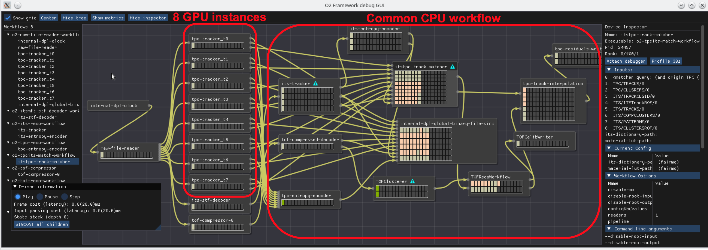

## FairMQ in a nutshell

Next-generation Particle Physics Experiments at [GSI](https://www.gsi.de)/[FAIR](https://www.gsi.de/forschungbeschleuniger/fair) and [CERN](https://home.web.cern.ch/) are facing [unprecedented data processing challenges](https://doi.org/10.1051/epjconf/201921405010). The expected data rates require a non-trivial amount of high performance compute (HPC) resources, i.e: Thausends of CPU/GPU cores per experiment. Online data processing/compression are crucial to fulfill the storage capacity requirements. The complexity of tasks that need to be performed during the online (synchronous) data processing is significantly higher than ever before. Complex tasks that usually runs offline (e.g: Calibration, Track finding, etc) have to run now online in a high performance and high throughput environment.

The [FairMQ C++ library](https://github.com/FairRootGroup/FairMQ/) is designed to aid the implementation of such large-scale online data processing workflows by

- providing an **asynchronous message passing abstraction** that integrates different existing data transport technologies (no need to re-invent the wheel),
- providing a **reasonably efficient data transport service** (zero-copy, high throughput - [TCP](https://zeromq.org/), [SHMEM](https://doi.org/10.1051/epjconf/201921405029), and [RDMA](https://doi.org/10.1051/epjconf/201921405022) implementations available),
- being **data format agnostic** (suitable data formats are usually experiment-specific), and
- providing other **basic building blocks** such as a simple state machine based execution framework and a plugin mechanism to integrate with external config/control systems.

FairMQ is not an end-user application, but a library and framework used by experiment software experts to implement higher-level experiment-specific applications.

The screenshot shows a visualization of the data processing workflow on a single [Alice](https://home.cern/science/experiments/alice) event processing node (The "O2 Framework debug GUI" tool in the screenshot is part of the [AliceO2 project](https://aliceo2group.github.io/AliceO2/)). Data logically flows along the yellow edges (in this case via the FairMQ shmem data transport) through the various processing stages of which some are implemented as GPU and others as CPU algorithms.

Although FairMQ was initially designed for the synchronous (online) data processing, it has been successfully used to parallelize asynchronous (offline) [simulation](https://doi.org/10.1051/epjconf/201921402029) and [analysis](https://doi.org/10.1051/epjconf/201921405045) workloads.
